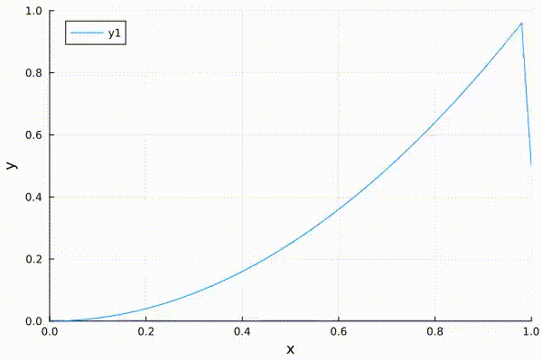
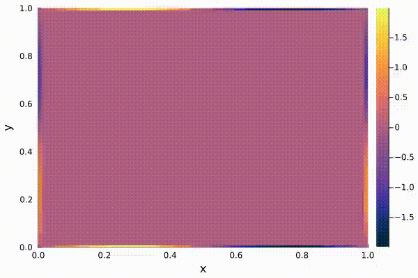

# Numerical Solutions for Poisson's Equation in 1D, 2D, 3D using the Finite Difference Method

This repository contains the code to solve numerically and visualise Poisson's Equation in 1D, 2D and 3D with Dirichlet and Neumann Boundary Conditions.

The solving method used is the Finite Difference method. https://en.wikipedia.org/wiki/Finite_difference_method

The programming language used is Julia.


## Files

1D_BF.jl : Numerical Solution in 1D with Fixed Boundary Condition

1D_NBC_2O.jl : Numerical Solution in 1D with Neumann Boundary Condition, 2nd Order

2D_BF.jl : Numerical Solution in 2D with Fixed Boundary Condition

2D_NBC_2O.jl : Numerical Solution in 2D with Neumann Boundary Condition, 2nd Order

3D_BF.jl : Numerical Solution in 3D with Fixed Boundary Condition

MorePDEs : Some other Numerical Solution of PDEs (Heat equation, Wave equation)

## Dependecies

To run this code you will need Julia installed in your pc. You can download it here : https://julialang.org/downloads/

This code uses 4 Julia packages : SparseArrays, LinearAlgebra, PyPlot and PlotlyJS. 

To install this packages run this commands in the Julia terminal :

```Julia
  using Pkg
  Pkg.add("SparseArrays")
  Pkg.add("LinearAlgebra")
  Pkg.add("PyPlot")
  Pkg.add("PlotlyJS")
```

## Run the code

To run any file use this command in terminal :

```Cmd
  julia /path/to/file.jl
```
## Some Results

### 2D Poisson's Equation (Dirichlet Boundary Condition)
```math
\frac{\partial^2 u}{\partial x^2}+ \frac{\partial^2 u}{\partial y^2} = f(x,y)
```
Boundary Condition :

 

Function that we are solving for :
```math
f(x,y) = 10(x^2+y^2)
```
<br>


Numerical Solution :


### 2D Poisson's Equation (Neumann Boundary Condition)
```math
\frac{\partial^2 u}{\partial x^2}+ \frac{\partial^2 u}{\partial y^2} = f(x,y)
```

Boundary Condition :

```math
\frac{\partial u(0,y)}{\partial y} = 0
```

Function that we are solving for :
```math
f(x,y) = 1
```
<br>


Numerical Solution :


### 3D Poisson's Equation (Dirichlet Boundary Condition)
```math
\nabla^2u=f(x,y,z)
```

Boundary Condition :
```math
All\ boundaries = 0
```


Function that we are solving for :

```math
f(x,y,z) = x^2+0.4
```
<br>


Numerical Solution :


### 1D Wave Equation
```math
\frac{\partial^2 u}{\partial t^2} = c^2 \frac{\partial^2u}{\partial x^2}  
```
<br>


### 1D Heat Equation

```math
\frac{\partial u}{\partial t} = D^2 \frac{\partial^2u}{\partial x^2}  
```
<br>

Fixed Boundary Condition :

 

Neumann Boundary Condition :


### 2D Heat Equation

```math
\frac{\partial u}{\partial t} = D^2 .\nabla^2u 
```
<br>

Fixed Boundary Condition :


Numerical Solution :




<br>

<br>

# Author
Marti JIMENEZ : [@Marti2405](https://github.com/Marti2405)

Date : 06/2023


